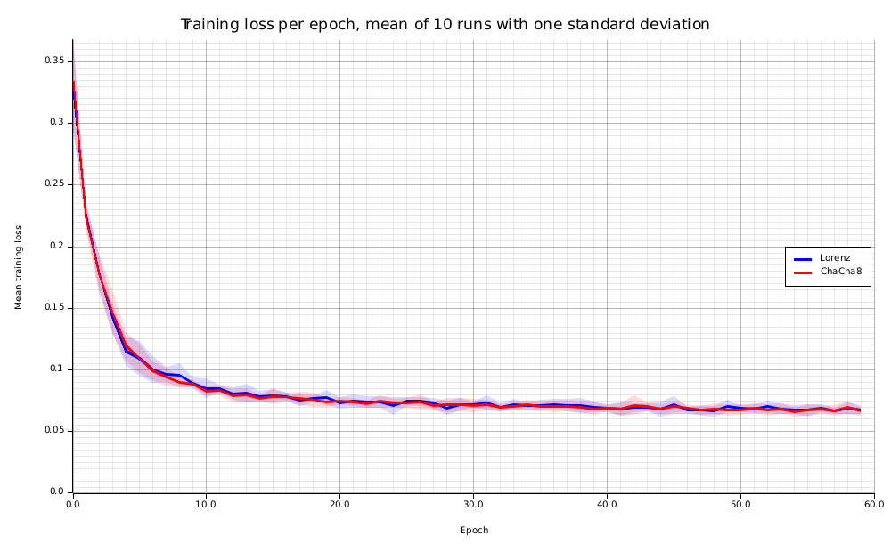
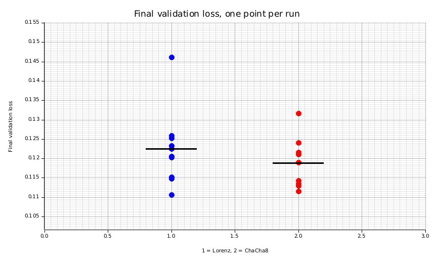

# Chaos-driven pseudo-randomness against ChaCha8 in neural network training

Status: Phase 0 and Phase 1 complete. Phase 2 not executed; see
[Phase 2](#phase-2-not-executed).

All numbers below were produced by the code in this repository on the date and
hardware stated in [Execution environment](#execution-environment). Nothing is
quoted from literature except where a reference is given, and nothing was
selected after the fact except where explicitly labelled post hoc.

## 1. Question and hypothesis

A deterministic generator driven by the Lorenz attractor is compared against
ChaCha8 as the source of randomness at three points of a training pipeline:
weight initialisation, dropout masks, and minibatch order.

The question is not whether the chaotic generator is better. It is whether it is
**statistically distinguishable** from a standard generator, while offering
exact deterministic reproducibility from a seed.

**H0.** Under identical architecture, identical data and an identical compute
budget, there is no statistically significant difference (alpha = 0.05) between
the two generators in final validation loss, convergence speed, or
generalisation gap.

**Falsification criterion, fixed before any run.** With N = 10 runs per
condition, normality of each sample is assessed with Shapiro-Wilk; Welch's test
is applied when neither sample is rejected, and Mann-Whitney U otherwise. If the
resulting two-sided p-value for final validation loss is below 0.05, H0 is
rejected and Cohen's d is reported.

## 2. Method

**Generator under test.** The Lorenz system, integrated with fixed-step
classical RK4 at dt = 0.01, with the standard chaotic parameters sigma = 10,
rho = 28, beta = 8/3. Ten thousand steps are discarded as burn-in so the orbit
settles on the attractor. Between samples the orbit advances five steps.

**Extraction method.** The macroscopic coordinates are strongly non-uniform: the
invariant measure of the attractor concentrates on two lobes, so rescaling a
coordinate into the unit interval fails a uniformity test outright. Instead each
coordinate is scaled by 2^28 and its fractional part taken, which keeps only
digits far below the scale of the attractor's own motion and above the
accumulated integration error. The three resulting words are combined and passed
through the SplitMix64 finaliser, a bijection, so the mixing cannot add entropy
that the orbit did not supply. The claim that these digits are near-uniform is
not assumed: it is what the Phase 0 battery measures.

**Control.** ChaCha8 seeded from the same 64-bit seed, exposed through an
identical interface. Both conditions use the same Box-Muller construction for
normal variates, the same Lemire rejection method for bounded integers, and the
same Fisher-Yates shuffle, so the only difference between conditions is the
underlying bit source.

**Controls against confounding.** The dataset and the train/validation split are
generated once, by ChaCha8, with fixed seeds distinct from the training seeds, so
both conditions see identical data. Both conditions receive the same list of ten
training seeds. The network, hyperparameters and number of optimisation steps are
identical.

## 3. Phase 0: generator qualification

One million variates per generator, chi-squared over 1000 equiprobable bins.
Acceptance criteria were fixed before running: uniformity not rejected at
alpha = 0.01, every autocorrelation up to lag 10 below 0.01 in absolute value,
and mean and variance within one percent of theory.

| Quantity | Lorenz | ChaCha8 | Theoretical |
|---|---|---|---|
| Samples | 1 000 000 | 1 000 000 | |
| Chi-squared (999 dof) | 1059.556 | 1014.616 | |
| Chi-squared p-value | 0.0896 | 0.3585 | |
| Mean | 0.500009 | 0.500281 | 0.5 |
| Variance | 0.083316 | 0.083191 | 0.083333 |
| Largest absolute autocorrelation, lags 1 to 10 | 0.00236 | 0.00203 | 0 |
| Verdict | PASS | PASS | |

Autocorrelations, lags 1 to 10:

- Lorenz: 0.00092, 0.00070, 0.00068, -0.00071, 0.00115, -0.00139, -0.00048, -0.00091, -0.00236, -0.00091
- ChaCha8: 0.00203, 0.00118, -0.00150, 0.00088, -0.00008, 0.00037, 0.00077, -0.00136, -0.00064, -0.00201

The Lorenz p-value of 0.0896 is the weakest result in the table. It clears the
0.01 gate that was fixed in advance, but it is also close enough to conventional
thresholds to deserve mention rather than silence: a single p-value near 0.09 is
not evidence of a defect, and equally it is not the comfortable margin that
ChaCha8 shows.

The battery is verified to have discriminating power: it rejects a monotone ramp
on autocorrelation and a squared-uniform stream on uniformity. A battery that
accepted everything would prove nothing about the generator.

**Scope.** These are basic sanity tests. They are necessary, not sufficient.
No claim is made that this generator would survive TestU01 or the NIST suite,
neither of which was run. It is not a cryptographic generator and must not be
used as one.

## 4. Phase 1: MLP on synthetic classification

**Task.** Two interleaved moons, 2000 samples, Gaussian noise of standard
deviation 0.20, split 75/25 into 1500 training and 500 validation observations.
The classes are not linearly separable.

**Network.** Two hidden layers of 32 units, ReLU, inverted dropout at p = 0.1,
softmax cross-entropy, Adam at learning rate 0.01, batch size 32, 60 epochs.
He normal initialisation. N = 10 runs per condition with seeds 1000 to 1009.

### Results

| Metric | Lorenz, mean ± sd | ChaCha8, mean ± sd | Test | p | Cohen's d | H0 |
|---|---|---|---|---|---|---|
| Final validation loss | 0.122441 ± 0.009684 | 0.118844 ± 0.006167 | Mann-Whitney U, exact | 0.3150 | 0.443 | not rejected |
| Final validation accuracy | 0.969200 ± 0.002860 | 0.968600 ± 0.003658 | Mann-Whitney U, normal approx. | 1.0000 | 0.183 | not rejected |
| Generalisation gap | 0.062599 ± 0.007468 | 0.061116 ± 0.005239 | Mann-Whitney U, exact | 0.4359 | 0.230 | not rejected |
| Epochs to threshold, pre-registered | 1.000 ± 0.000 | 1.000 ± 0.000 | Welch | 1.0000 | 0.000 | not rejected |
| Epochs to training loss < 0.10, post hoc | 7.200 ± 1.476 | 7.400 ± 1.075 | Welch | 0.7334 | -0.155 | not rejected |
| Wall-clock seconds per run | 1.116828 ± 0.010399 | 0.371316 ± 0.001490 | Mann-Whitney U, exact | 0.000011 | 100.363 | **rejected** |

The test applied to each metric was chosen by the data, not by preference:
Shapiro-Wilk was run on both samples first, and Welch was used only where
neither sample was rejected at alpha = 0.05. For final validation loss the
Lorenz sample gave Shapiro-Wilk p = 0.0473, marginally below the threshold,
which is why the non-parametric test was used there.

**A defect in the pre-registered convergence metric.** The threshold of 0.35 on
validation loss was fixed before running, and turned out to be reached by every
one of the twenty runs in its first epoch. The metric therefore has zero
variance and carries no information about convergence speed. The row is reported
anyway, because deleting a pre-registered metric that produced an uninformative
result would misrepresent the protocol. The post-hoc row beneath it uses a
tighter threshold on the training curves already recorded, and is exploratory:
it was chosen after seeing the data and must not be read as a confirmatory test.

**Reproducibility.** Both conditions reproduce bit for bit. Re-running the first
configuration of each condition reproduced the SHA-256 of the final parameters
and the exact bit pattern of the final validation loss. This is checked by the
`phase1` command itself, which exits non-zero if it fails, and by a unit test.

### Figures

Mean training loss per epoch over ten runs, with a band of one standard
deviation. The two curves and their bands overlap along the whole trajectory.

Final validation loss, one point per run, with the condition mean marked. The
distributions overlap substantially.

## 5. Interpretation

**H0 is not rejected** for final validation loss, validation accuracy, or
generalisation gap. It is rejected, decisively, for wall-clock time.

The failure to reject is not evidence of equivalence. With N = 10 per condition
the design has limited power: the observed effect size for final validation loss
is d = 0.44, and a two-sample comparison at alpha = 0.05 with N = 10 per group
has low power against an effect of that magnitude. In other words, an effect of
this size could easily be present and go undetected here. The correct statement
is that this experiment did not detect a difference, not that no difference
exists. Establishing equivalence would require an equivalence test against a
pre-specified margin, which was neither designed nor run.

The one clear result is the cost. The Lorenz generator took 1.117 seconds per
run against 0.371 for ChaCha8, three times slower, with an effect size so large
it is barely meaningful to quote. This is expected rather than surprising: each
variate costs five RK4 steps, that is fifteen evaluations of the Lorenz vector
field, against a few ARX rounds for ChaCha8. Whatever the case for a chaotic
generator, it will not be throughput.

The reproducibility property that motivated the comparison holds, but it is not
a discriminator: ChaCha8 reproduced bit for bit under exactly the same
conditions. Determinism from a seed is a property of any well-specified
pseudo-random generator, not a distinctive feature of the chaotic one.

## 6. Limitations

- **Sample size.** N = 10 per condition. Underpowered against small and moderate
  effects, as discussed above.
- **Scale.** A two-layer MLP with 2178 parameters on a two-dimensional synthetic
  task. Nothing here supports any claim about larger models, real data, or other
  architectures. Phase 2, which was intended to test that, was not executed.
- **One task, one architecture, one hyperparameter setting.** No sweep was run;
  a difference could exist in regions of the configuration space not sampled.
- **Single machine, single platform.** Bit-for-bit reproducibility was verified
  on one machine. Cross-platform reproducibility of the floating-point orbit is
  argued from the operations used, not measured on other hardware.
- **Statistical battery.** Basic tests only, as stated in Phase 0.
- **The pre-registered convergence threshold was badly chosen**, as described
  above.

## 7. Phase 2, not executed

The protocol called for a small character-level transformer on a public corpus,
with the same N = 10 per condition. It was not run, and no partial results are
reported for it.

The reason is compute. The machine available is a four-core AMD Ryzen 3 3200G
with integrated Vega 8 graphics and no CUDA. Phase 1, a network of roughly two
thousand parameters, took 1.1 seconds per run for the Lorenz condition. A
transformer of two to four layers at d_model 128 to 256 on a corpus of about one
megabyte is on the order of a million parameters and several orders of magnitude
more arithmetic per step; twenty runs of it on this CPU is not a matter of
minutes. Reporting a truncated version of that experiment, or a single run per
condition, would produce numbers that look like evidence without being evidence.

If Phase 2 is attempted, two things in this repository would need to change:
the hand-written backward pass would be replaced by an automatic
differentiation engine, and the randomness would need to remain externally
supplied so the injection points stay under experimental control.

## 8. Execution environment

- CPU: AMD Ryzen 3 3200G, 4 cores
- GPU: integrated Radeon Vega 8, not used
- Toolchain: rustc 1.97.1, release profile, opt-level 3, thin LTO, one codegen unit
- Date of the reported run: 2026-08-13
- Dependency versions pinned exactly in `Cargo.toml`

## 9. Reuse of existing work

The statistical tests and special functions in `crates/xstats` were implemented
from their published closed forms, as the protocol directed, to avoid a heavy
dependency. It is worth recording that overlapping functionality exists in
crates published by this project's author, in particular `yatrosci-stats`
(distributions and statistical functions), `yatrosci-special` (gamma, erf and
related), `yatrosci-random` (generation and sampling), `yatrosci-integrate` and
`yatrosci-ode` (RK4 and other solvers), and `yatrosci-ml-neural` (neural network
layers with autograd). None of them were used here and none were evaluated for
this purpose. `yatrosci-ml-neural` is the obvious candidate to examine first if
Phase 2 proceeds.

## 10. Conclusion

Within the scope of a small MLP on a synthetic task, with N = 10 runs per
condition, a Lorenz-driven generator was **not distinguishable** from ChaCha8 in
final validation loss, validation accuracy or generalisation gap, and was
**three times slower**. The experiment is a pilot. It does not establish
equivalence, and it says nothing about behaviour at scale.
